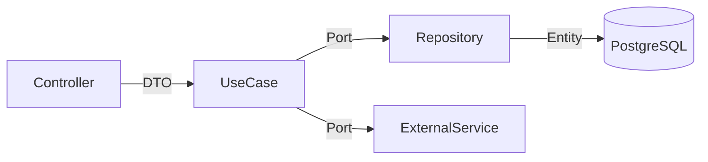

# nestjs-hexagonal-template

Production-ready NestJS template with Hexagonal Architecture, TypeORM, SuperTokens, and Zod.

---

## Quick Start

```bash
# 1. Clone the repository
git clone https://github.com/your-org/nestjs-hexagonal-template.git
cd nestjs-hexagonal-template

# 2. Install dependencies
npm install

# 3. Copy the environment file
cp .env.example .env

# 4. Start infrastructure (PostgreSQL, SuperTokens, Redis, LocalStack)
docker compose up -d

# 5. Create the database schema (the template ships no committed migration)
npm run migration:generate -- src/database/migrations/InitialSchema
npm run migration:run

# 6. Run the application in development mode
npm run start:dev
```

Runtime dependencies: **PostgreSQL 16**, **Redis 7** (BullMQ broker), **SuperTokens core** and, if you use file storage, an **S3-compatible endpoint** (LocalStack locally). All four ship in `docker-compose.yml`; if you provide your own services, Redis is not optional — the BullMQ worker keeps reconnecting without it and `GET /api/health` reports `redis: down`.

The API will be available at `http://localhost:3000`.
Swagger docs at `http://localhost:3000/api/docs` — only mounted when `ENABLE_SWAGGER=true` is set (it is in `.env.example`). The Swagger routes sit outside the guard pipeline, so keep the variable unset anywhere but local development.

---

## Architecture

This project follows **Hexagonal Architecture** (Ports & Adapters), ensuring that business logic remains isolated from infrastructure concerns.



Each module is organized in three layers:

| Layer              | Responsibility                                | Path              |
| ------------------ | --------------------------------------------- | ----------------- |
| **Domain**         | Entities, ports (interfaces), domain services | `domain/`         |
| **Application**    | Use cases, DTOs, mappers                      | `application/`    |
| **Infrastructure** | Controllers, TypeORM repositories, HTTP       | `infrastructure/` |

For a detailed explanation, see [docs/ARCHITECTURE.md](docs/ARCHITECTURE.md).

---

## Directory Structure

```
src/
├── common/             # Shared utilities, guards, filters, pipes, decorators
│   ├── constants/
│   ├── decorators/
│   ├── enums/
│   ├── exceptions/
│   ├── filters/
│   ├── guards/
│   ├── interceptors/
│   ├── interfaces/
│   ├── middleware/
│   ├── pipes/
│   └── utils/
├── config/             # App configuration (env, TypeORM, etc.)
├── database/           # Migrations
│   └── migrations/
├── logger/             # Winston logger setup
├── health/             # Health check endpoint (db, storage, redis)
├── queue/              # Shared BullMQ/Redis connection
├── auth/               # SuperTokens authentication
├── audit-log/          # Audit log module
├── tenant/             # Tenant module (multi-tenancy)
├── tenant-feature/     # Per-tenant feature flags (@RequiresFeature + FeatureGuard);
│                       # FeatureKey ships empty, fill it in your project
├── user/               # User module
├── sample/             # Sample module (reference implementation)
├── storage/            # S3/LocalStack file storage
├── app.module.ts
├── instrument.ts       # OpenTelemetry instrumentation
└── main.ts
```

---

## Available Scripts

| Script                                                                | Description                                                          |
| --------------------------------------------------------------------- | -------------------------------------------------------------------- |
| `npm run start:dev`                                                   | Start the app in watch mode                                          |
| `npm run build`                                                       | Compile the project                                                  |
| `npm run lint`                                                        | Run ESLint with auto-fix                                             |
| `npm run lint:check`                                                  | ESLint without auto-fix, `--max-warnings 0` (CI gate)                |
| `npm run format:check`                                                | Prettier in check mode, covers `docs/**/*.md` and `.github/**/*.yml` |
| `npm run typecheck`                                                   | `tsc --noEmit` over the whole project, including `test/`             |
| `npm test`                                                            | Run unit tests                                                       |
| `npm run test:e2e`                                                    | Run end-to-end tests                                                 |
| `npm run migration:generate -- src/database/migrations/MigrationName` | Generate a new TypeORM migration (the path is required)              |
| `npm run migration:run`                                               | Run pending migrations                                               |

---

## Tech Stack

- **Runtime:** Node.js 24 (22.13+ LTS also supported) + TypeScript 5
- **Framework:** NestJS 11
- **ORM:** TypeORM 1.1
- **Database:** PostgreSQL 16
- **Queues:** BullMQ (@nestjs/bullmq) over Redis 7
- **Authentication:** SuperTokens
- **Validation:** Zod 4
- **API Docs:** Swagger (via @nestjs/swagger)
- **Observability:** OpenTelemetry + Winston
- **Storage:** AWS S3 (LocalStack for local dev)
- **Security:** Helmet, Throttler
- **Testing:** Jest + Supertest

---

## Documentation

| Document                                | Description                            |
| --------------------------------------- | -------------------------------------- |
| [ARCHITECTURE.md](docs/ARCHITECTURE.md) | Detailed architecture explanation      |
| [CLAUDE.md](CLAUDE.md)                  | AI agent guide and project conventions |

---

## Customization Checklist

After cloning this template for a new project, complete the following steps:

- [ ] Rename project in `package.json`
- [ ] Update Swagger title/description in `main.ts`
- [ ] Update `OTEL_SERVICE_NAME` in `.env`
- [ ] Add roles in the `Role` enum
- [ ] Add project-specific error codes
- [ ] Remove or rename the `sample` module
- [ ] Update database name in `docker-compose.yml`
- [ ] Personalize `CLAUDE.md` with project context
- [ ] Remove this checklist

---

## License

[MIT](LICENSE)
