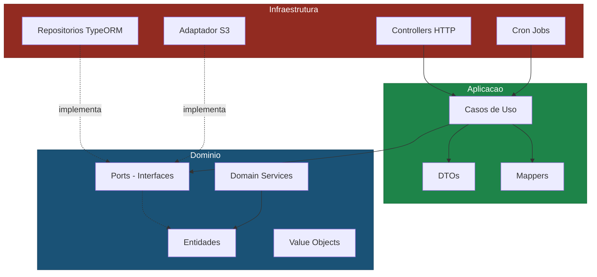
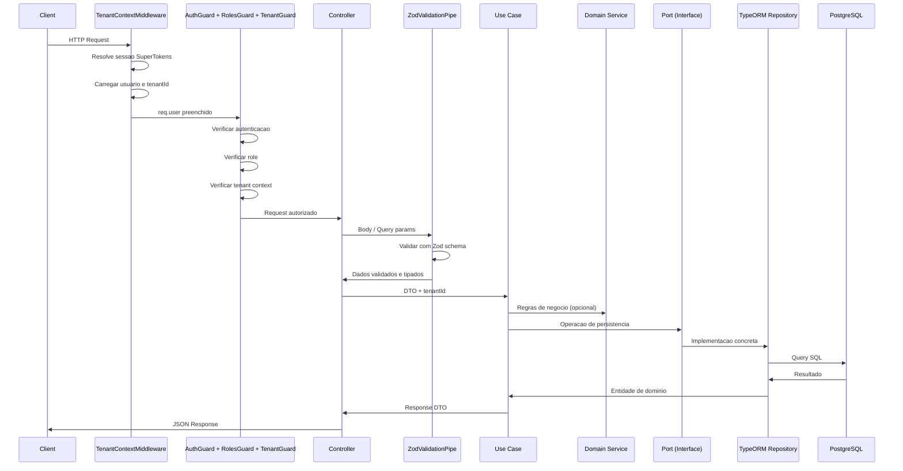
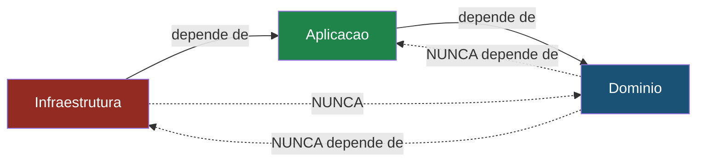
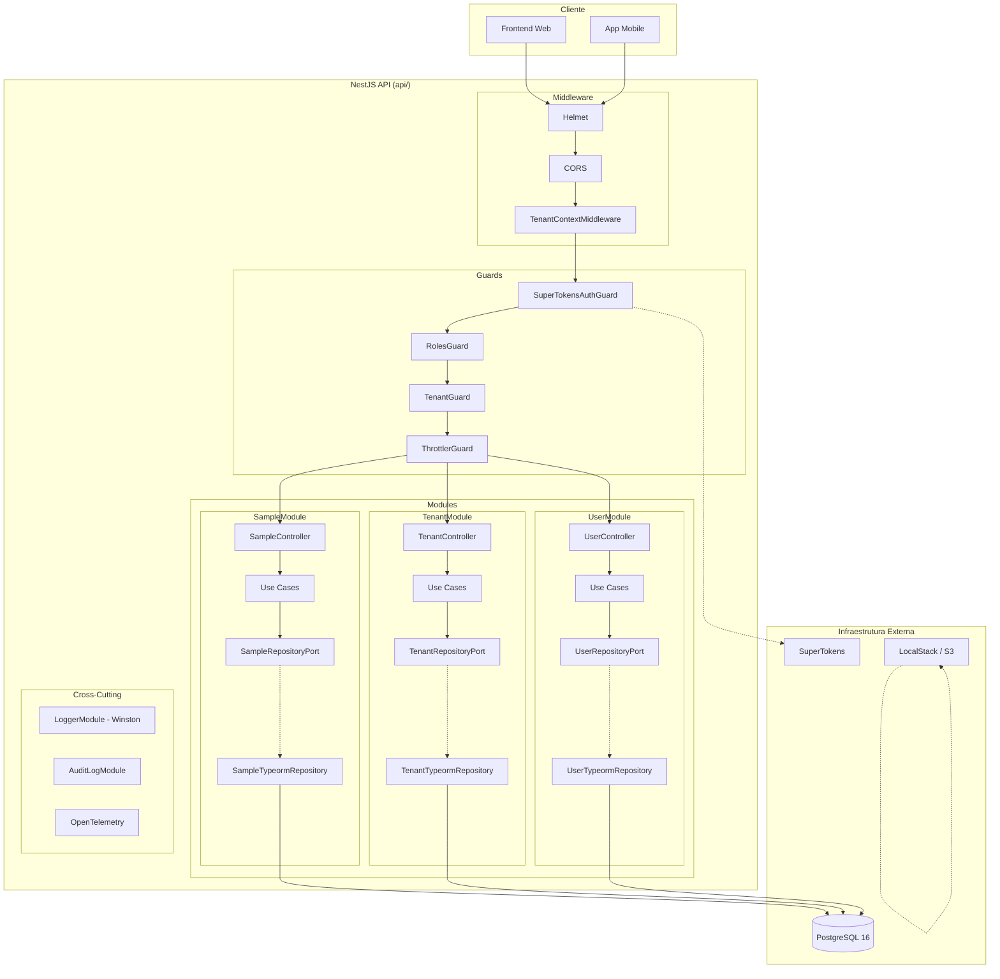

# Arquitetura do Projeto

## Visao Geral

Este projeto segue a **Arquitetura Hexagonal** (tambem conhecida como Ports & Adapters), proposta por Alistair Cockburn. O objetivo central e isolar a logica de negocio de qualquer detalhe de infraestrutura -- banco de dados, frameworks HTTP, servicos externos -- de forma que o dominio seja puro, testavel e independente.

---

## O que e Arquitetura Hexagonal (Ports & Adapters)

A Arquitetura Hexagonal organiza o software em tres camadas concentricas:

1. **Dominio** (centro) -- entidades, regras de negocio, interfaces de porta
2. **Aplicacao** (intermediaria) -- casos de uso, orquestracao, DTOs, mappers
3. **Infraestrutura** (periferia) -- controllers HTTP, repositorios TypeORM, adaptadores S3, cron jobs

A comunicacao entre camadas ocorre exclusivamente por meio de **Ports** (interfaces definidas no dominio) e **Adapters** (implementacoes concretas na infraestrutura).



---

## Responsabilidades de Cada Camada

### `domain/` -- Nucleo do Negocio

O dominio e o coracao da aplicacao. Ele contem:

| Artefato    | Descricao                                                                           |
| ----------- | ----------------------------------------------------------------------------------- |
| `entities/` | Classes puras que representam conceitos do negocio (ex: `Sample`, `Tenant`, `User`) |
| `ports/`    | Interfaces que definem contratos de persistencia e servicos externos                |
| `services/` | Domain services com regras de negocio que nao pertencem a uma unica entidade        |

**Regra fundamental:** ZERO dependencias externas. Nenhum import de NestJS, TypeORM, AWS SDK ou qualquer biblioteca de infraestrutura. Apenas TypeScript puro.

```typescript
// src/sample/domain/entities/sample.entity.ts
export class Sample {
  id: string;
  tenantId: string;
  name: string;
  description: string | null;
  isActive: boolean;
  createdAt: Date;
  updatedAt: Date;
  deletedAt: Date | null;

  constructor(props: {
    id?: string;
    tenantId: string;
    name: string;
    description?: string | null;
    isActive?: boolean;
    createdAt?: Date;
    updatedAt?: Date;
    deletedAt?: Date | null;
  }) {
    this.id = props.id ?? '';
    this.tenantId = props.tenantId;
    this.name = props.name;
    this.description = props.description ?? null;
    this.isActive = props.isActive ?? true;
    this.createdAt = props.createdAt ?? new Date();
    this.updatedAt = props.updatedAt ?? new Date();
    this.deletedAt = props.deletedAt ?? null;
  }
}
```

### `application/` -- Orquestracao

A camada de aplicacao coordena o fluxo entre o mundo externo e o dominio:

| Artefato     | Descricao                                                                                         |
| ------------ | ------------------------------------------------------------------------------------------------- |
| `use-cases/` | Classes `@Injectable()` que orquestram o fluxo: recebem DTO, convertem para dominio, chamam ports |
| `dtos/`      | Schemas Zod que definem contratos de entrada/saida. Tipos inferidos com `z.infer<>`               |
| `mappers/`   | Funcoes estaticas para conversao entre camadas: `toDomain()`, `toResponse()`                      |

```typescript
// src/sample/application/use-cases/create-sample.use-case.ts
@Injectable()
export class CreateSampleUseCase {
  constructor(
    @Inject(SAMPLE_REPOSITORY)
    private readonly sampleRepo: SampleRepositoryPort,
  ) {}

  async execute(
    dto: CreateSampleDto,
    tenantId: string,
  ): Promise<SampleResponseDto> {
    const sample = SampleMapper.toDomain(dto, tenantId);
    const saved = await this.sampleRepo.save(sample);
    return SampleMapper.toResponse(saved);
  }
}
```

### `infrastructure/` -- Adaptadores

A camada de infraestrutura contem tudo que interage com o mundo externo:

| Artefato       | Descricao                                                                          |
| -------------- | ---------------------------------------------------------------------------------- |
| `http/`        | Controllers NestJS com decorators de rota, validacao e Swagger                     |
| `persistence/` | Entidades TypeORM (`.typeorm-entity.ts`) e repositorios (`.typeorm-repository.ts`) |
| `queue/`       | Adapter de fila (`@InjectQueue`) e processor BullMQ (`extends WorkerHost`)         |
| `*.module.ts`  | Modulo NestJS que faz o wiring entre ports e adapters                              |

---

## Fluxo de uma Requisicao

O diagrama abaixo ilustra o caminho completo de uma requisicao HTTP ate o banco de dados:



---

## Injecao de Dependencia com Symbol Tokens

A ligacao entre ports (interfaces) e adapters (implementacoes) acontece no modulo via **Symbol tokens** do NestJS. Isso garante que os use cases dependam apenas de interfaces, nunca de implementacoes concretas.

```typescript
// 1. Definir o Symbol e a interface no dominio
export const SAMPLE_REPOSITORY = Symbol('SAMPLE_REPOSITORY');

export interface SampleRepositoryPort {
  save(sample: Sample): Promise<Sample>;
  findById(id: string, tenantId: string): Promise<Sample | null>;
  findAll(
    tenantId: string,
    page: number,
    perPage: number,
  ): Promise<[Sample[], number]>;
  update(sample: Sample): Promise<Sample>;
  softDelete(id: string, tenantId: string): Promise<void>;
}

// 2. Injetar no use case via @Inject(SYMBOL)
@Injectable()
export class CreateSampleUseCase {
  constructor(
    @Inject(SAMPLE_REPOSITORY)
    private readonly sampleRepo: SampleRepositoryPort,
  ) {}
}

// 3. Fazer o binding no modulo
@Module({
  providers: [
    {
      provide: SAMPLE_REPOSITORY,
      useClass: SampleTypeormRepository,
    },
    CreateSampleUseCase,
  ],
})
export class SampleModule {}
```

Para trocar a implementacao (ex: de TypeORM para Prisma, ou para um repositorio em memoria nos testes), basta alterar o `useClass` no modulo -- nenhum use case precisa ser modificado.

---

## Regra de Dependencia

As dependencias devem **sempre** apontar para dentro (em direcao ao dominio). Nunca o contrario.



**Regras praticas:**

- `domain/` nao importa nada de `application/` nem de `infrastructure/`
- `application/` importa de `domain/` mas nunca de `infrastructure/`
- `infrastructure/` importa de `application/` e `domain/`
- Decorators do NestJS (`@Injectable`, `@Inject`) sao permitidos em `application/use-cases/` por necessidade do framework, mas nenhuma logica de infraestrutura deve vazar

---

## Multitenancy

O projeto implementa multitenancy a nivel de linha (row-level isolation), onde cada registro no banco esta associado a um `tenantId`.

### Fluxo de Resolucao do Tenant

```mermaid
flowchart TD
    REQ[Request HTTP] --> MW[TenantContextMiddleware]
    MW -->|1. Resolve sessao| ST[SuperTokens]
    ST -->|userId| MW
    MW -->|2. Busca usuario| UREPO[UserRepository]
    UREPO -->|user.tenantId| MW
    MW -->|3. Preenche req.user| GUARD[TenantGuard]
    GUARD -->|tenantId presente?| OK{Sim}
    OK -->|Sim| CTRL[Controller]
    OK -->|Nao| ERR[403 TENANT_CONTEXT_MISSING]
    GUARD -->|SUPERADMIN?| BYPASS[Bypass sem tenant]
    BYPASS --> CTRL
    CTRL -->|@TenantId decorator| UC[Use Case]
    UC -->|tenantId| REPO[Repository]
    REPO -->|WHERE tenantId = ?| DB[(PostgreSQL)]
```

### Camadas de Protecao

1. **TenantContextMiddleware**: Intercepta toda requisicao, resolve a sessao SuperTokens, busca o usuario no banco e preenche `req.user` com `userId`, `tenantId` e `role`.

2. **TenantGuard**: Valida que o `tenantId` esta presente no contexto. Superadmins operam sem restricao de tenant.

3. **FeatureGuard**: Só age em rotas marcadas com `@RequiresFeature()`; nas demais devolve `true` sem tocar em cache ou banco. Quando a flag esta desligada para o tenant, responde 403 `FEATURE_DISABLED`. Vive em `src/tenant-feature/infrastructure/http/` (e nao em `src/common/guards/`) porque depende do `TenantFeatureService` — `common` nao deve conhecer modulo de feature. Superadmins tem bypass, na mesma ordem do `TenantGuard`.

4. **Repository Adapter**: Toda query inclui `WHERE tenantId = :tenantId`, garantindo isolamento a nivel de dados. O `tenantId` e passado como parametro obrigatorio em todos os metodos do port.

---

## Diagrama Geral da Arquitetura



> **Rate limiting nao e middleware.** O `ThrottlerGuard` e registrado como `APP_GUARD` em `src/app.module.ts`, depois dos guards de auth/roles/tenant. Duas consequencias praticas:
>
> - As rotas de `/api/auth/*` **nao passam por ele**. Elas sao atendidas pelo middleware Express do `supertokens-nestjs`, que responde sem chamar `next()`, entao nenhum `APP_GUARD` roda. Proteger login e signup contra forca bruta exige rate limit por IP no proxy/WAF.
> - O storage padrao do throttler e **in-memory por processo**: com N replicas o limite efetivo e N x `THROTTLE_LIMIT`, e ele zera a cada restart.

---

## Estrutura de Pastas

```
src/
  common/                  # Codigo compartilhado entre modulos
    constants/
    decorators/            # @CurrentUser, @TenantId, @Public, @Roles
    enums/                 # Role, ErrorCode
    exceptions/            # DomainException
    filters/               # GlobalExceptionFilter
    guards/                # RolesGuard, TenantGuard
    interceptors/          # AuditLogInterceptor
    interfaces/            # ApiResponse, PaginatedResponse
    middleware/             # TenantContextMiddleware
    pipes/                 # ZodValidationPipe
    utils/                 # pagination, validate-cpf, validate-cnpj

  config/                  # Configuracoes do app, database, redis, supertokens
  database/                # DatabaseModule, migrations, typeorm-cli config
  queue/                   # QueueModule: conexao BullMQ/Redis compartilhada
  logger/                  # Winston logger customizado
  health/                  # Health check endpoint (db, storage, redis)
  auth/                    # SuperTokens integration
  storage/                 # S3/LocalStack storage adapter
  anti-bot/                # Camadas anti-bot opt-in (@AntiBot), ports + guards
  realtime/                # Gateway Socket.io por tenant + IoAdapter com CORS

  audit-log/               # Modulo de log de auditoria
    domain/
      entities/
      ports/
    infrastructure/
      persistence/
      http/

  tenant/                  # Modulo de tenant (mesmo padrao)
    domain/ -> application/ -> infrastructure/

  tenant-feature/          # Feature flags por tenant (FeatureKey chega VAZIO)
    domain/
      entities/            # tenant-feature.entity.ts
      enums/               # feature-key.enum.ts (preencha no seu projeto)
      ports/               # repository + cache
    application/
      dtos/ mappers/ services/ use-cases/
    infrastructure/
      cache/               # in-memory-tenant-feature.cache.ts
      http/                # controller, FeatureGuard, @RequiresFeature
      persistence/

  user/                    # Modulo de usuario
    domain/ -> application/ -> infrastructure/

  sample/                  # Modulo de exemplo (referencia para novos modulos)
    domain/
      entities/            # sample.entity.ts
      ports/               # sample.repository.port.ts, sample-queue.port.ts
      services/            # sample-domain.service.ts
    application/
      dtos/                # sample.dto.ts (Zod schemas)
      mappers/             # sample.mapper.ts
      use-cases/           # create-sample, list-samples, etc.
    infrastructure/
      http/                # sample.controller.ts
      persistence/         # sample.typeorm-entity.ts, sample.typeorm-repository.ts
      queue/               # sample-queue.adapter.ts, sample.processor.ts, constantes
      sample.module.ts     # Wiring do modulo
```
